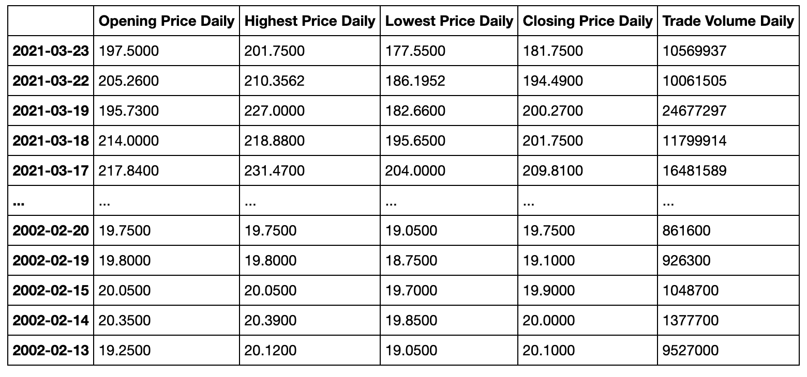
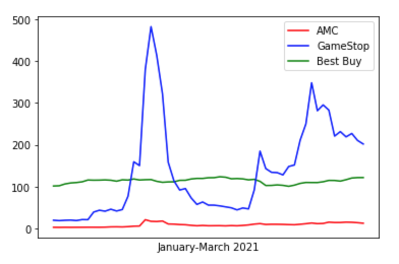
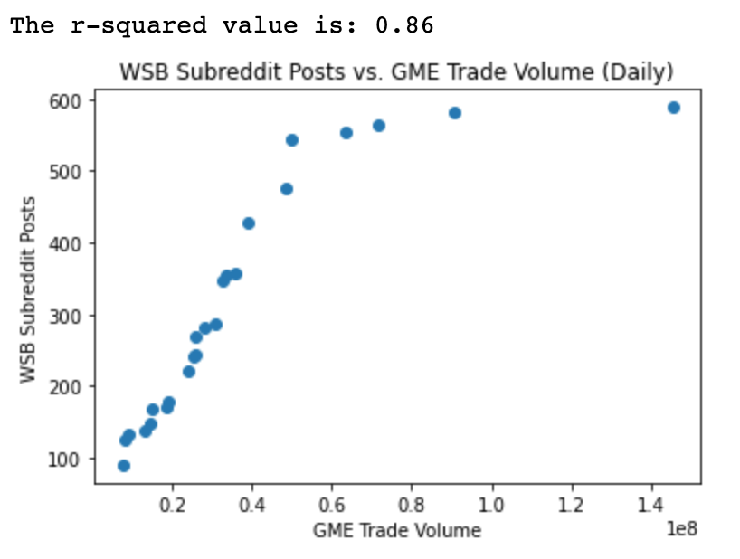

# An Exploration of the GameStop Stock Phenomenon

The GameStop stock phenomenon creates opportunity for an interesting case study. We were curious to analyze the rise and fall of GameStop stock through the first 2+ months of 2021 compared to the stock's historical data, explore GameStop's trajectory compared to that of other stocks in early 2021, and the effect of a subreddit, “wallstreetbets,” on the collective buying power of GameStop stock.

### Research Questions

##### Historical GME Stock Analysis

We utilized the measures in this table to conduct our historical stock analysis.

##### 2021 Stock Comparison: GME, AMC, BBY

We compared the daily stock prices of GameStop (GME), AMC Entertainment (AMC), and Best Buy (BBY) in the first two-plus months of 2021 in this graph.

##### Correlation: Wallstreetbets Subreddit Posts vs. GME Trade Volume

Here, we used our CSV data for the number of wallstreetbets Subreddit posts and the daily trade volume of GME to test for a correlation between subreddit activity and trade volume. After removing outliers, days with over 1,000 Subreddit posts, we found that there is a very strong positive correlation between Wall Street Bets Subreddit posts and GME trade volume (r-squared value of 0.86).

### Conclusions

When looking at the daily highest stock price for GME since inception, every day since January 25th is an outlier.

A 2021 stock comparison between GME, AMC, and BBY highlights how volatile GME’s price movement has been. 

Because we have a high r-squared value, there is likely a correlation between wallstreetbets Subreddit posts and GME stock trading volume. Further analysis is need, as we were working with a small sample size.

### Data Sources

AlphaVantage API Stock Market Data: www.alphavantage.co

Pre-Scraped CSV file with posts for subreddit wallstreetbets: www.kaggle.com/gpreda/reddit-wallstreetbets-posts
